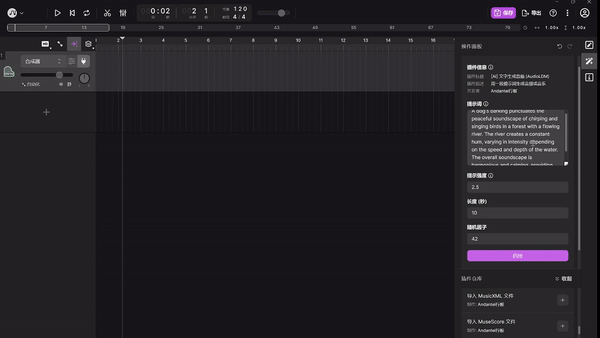

# AudioLDM TuneFlow Plugin

Fork of https://github.com/haoheliu/AudioLDM as a TuneFlow Plugin



## Usage

> **Note:** It is highly recommended to create a venv to run this plugin.

Steps to run the plugin:

0. Install **TuneFlow Desktop** by downloading the app from https://tuneflow.com

1. Clone this repo, and install dependencies using:

```bash
pip install -r requirements.txt
```

2. Download the model from https://huggingface.co/spaces/haoheliu/audioldm-text-to-audio-generation/blob/main/ckpt/ldm_trimmed.ckpt, and place it under the `ckpt` folder.

3. Run the plugin:

```bash
python debug.py
```

4. Start TuneFlow Desktop and run the "Plugin Development" plugin.
